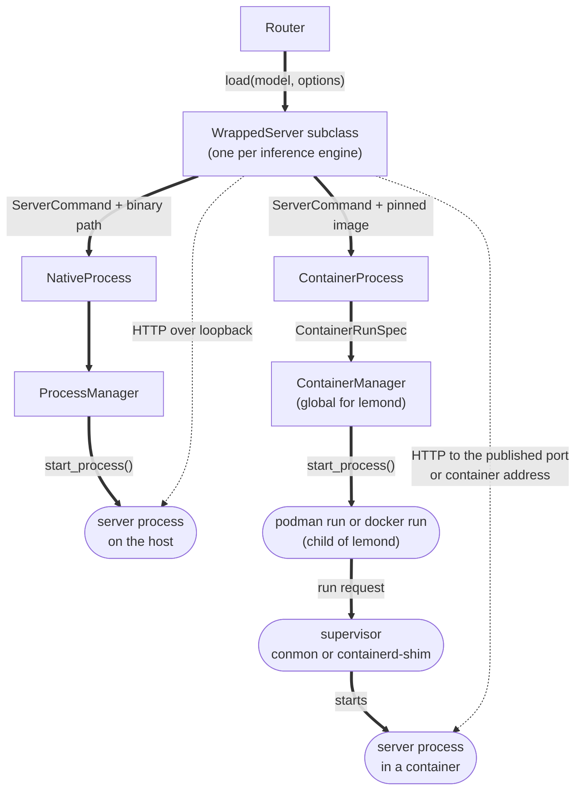

# Container Backends Spec

- [Summary](#summary)
- [Design Philosophy](#design-philosophy)
- [Scope](#scope)
- [New Backend Descriptor Labels](#new-backend-descriptor-labels)
- [Class Architecture](#class-architecture)
- [Command Contract](#command-contract)
- [Setup by Install Type](#setup-by-install-type)
- [Image Updates](#image-updates)
- [Appendix A: Ramalama and AI Cockpit Conventions, and Where Lemonade Differs](#appendix-a-ramalama-and-ai-cockpit-conventions-and-where-lemonade-differs)
- [Appendix B: Halogen Launch Commands](#appendix-b-halogen-launch-commands)

## Summary

This spec describes how we will add 4 new container backends to Lemonade.

A **container backend** is a Lemonade backend whose executable is a digest-pinned OCI image instead of a downloaded binary.

- Install, load, unload, `/system-info`, benchmarking and the backend manager work unchanged.
- The one new host requirement is a container tool on Linux: Podman first, then Docker, each verified by a socket probe. Users will be guided to install Podman if needed.

## Design Philosophy

Lemonade follows [Ramalama](https://github.com/containers/ramalama)'s container conventions wherever they apply, and [AI Cockpit](https://github.com/kyuz0/ai-toolbox-cockpit)'s wherever the choice belongs to this hardware. A dagger (†) marks an item taken from Ramalama, a double dagger (‡) one taken from AI Cockpit, and a section mark (§) one both already share, on the item or at the end of a table cell for the whole cell. **[Appendix A](#appendix-a-ramalama-and-ai-cockpit-conventions-and-where-lemonade-differs)** sources each against Ramalama v0.24.0 and AI Cockpit v2026.9.19.1535.

## Scope

### Phase 1 (This Proposal)

This spec describes the initial batch of PRs into Lemonade, with future work expected to follow after. The future work will have its own spec.

- **Platform.** Linux-only, GPU-only. Single GPU.
- **Image sources.**
  - Donato's Docker Hub account for rocmfpx, nathanw, and ds4.
  - Peonist's ghcr.io account for Halogen.
- **Models.** Downloaded by Lemonade and mounted read-only. Mounts and privileges are Lemonade's to set.
- **Packaging.**
  - The PPA, the GitHub release .deb and .rpm, Arch's `lemonade-server` package, source builds and the embedded SDK tarball will natively support the container backends.
  - Lemonade's Docker image, the `lemonade-server` snap and toolbox/distrobox will support them by driving Podman or Docker on the host (see [Sandboxed Hosts](#sandboxed-hosts)).

### Future Work

Not specified in this document, but should not be precluded by this spec either. Each of this would be its own future RFC/spec.

- **Functional parity with AI Cockpit**, including all of Donato's images rather than the four engines here, and the operator features listed at the end of [Appendix A](#appendix-a-ramalama-and-ai-cockpit-conventions-and-where-lemonade-differs).
- **A container backend interface standard**, where an image describes its own suggested models and options so the registry follows the image rather than a pinned list.
- **A backend plugin system**, where a backend declares itself through standard metadata and its sandbox policy is generated from that declaration.
- **Agent containers**, with Lemonade orchestrating frontend containers and linking them to backend containers.

## New Backend Descriptor Labels

Users and clients will be able to assess critical information about each backend at a glance using these two new labels.

Its **tier** is one of:

1. `core`: supported by Lemonade's maintainers for production use.
2. `community`: provided by Lemonade's maintainers, but not supported for production use.
3. `experimental`: developed in the community and listed in Lemonade. Use at your own risk.

Its **format** is one of:

1. `native`: backend is a compiled executable binary.
2. `python`: backend is implemented in Python and packaged for portability with a Python interpreter inside.
3. `container`: backend is implemented as an OCI container, deploys as a sandboxed image, and requires a pre-installed container tool (Podman or Docker).

Tier and format are set per backend. Examples:
- `llamacpp:rocm`: core, native
- `vllm:rocm`: community, python
- `halogen:rocm`: experimental, container

Lemonade's GUI and CLI will display a disclaimer the first time the user attempts to install an experimental backend. Models specific to an experimental backend should not be displayed in `/v1/models?show_all=true` until the backend has been installed.

> Note: we can keep the experimental boolean label in the descriptor to avoid a breaking change.

## Class Architecture

`WrappedServer` is Lemonade's main primitive: a subclass per inference engine, each spawning a server subprocess and proxying HTTP to it. This spec adds the concept of a **container backend** to the existing concept of a **native backend**. This section describes the class architecture that enables native and container backends to share as many concepts as possible, while diverging where necessary.



*Rectangles are classes, rounded boxes are OS processes. Thick edges carry the command down the stack; dotted edges are the steady-state request path.*

### Container Backends

A container backend runs its server from an OCI image pinned by digest. Three pieces define it:

- Its `BackendDescriptor` names the image and the container's permissions (see [`containers` Descriptor Field](#containers-descriptor-field)).
- Its `WrappedServer` subclass passes engine settings as environment variables (see [Engine Settings](#engine-settings)).
- `backend_versions.json` pins the image's digest (see [Version Pins](#version-pins)).

#### `containers` Descriptor Field

Each `BackendDescriptor` contains the information needed to install and launch that backend, organized in a standardized format. `BackendDescriptor` gets a new struct, `ContainerPolicy`, that holds a container backend's image repository, and the device nodes and Linux permissions its container gets:

| Field | Required | Meaning | Adds to the run command |
| --- | --- | --- | --- |
| `repository` | Yes | Where the image is published. Only `docker.io/kyuz0/*` and `ghcr.io/peonist-ai/*` are allowed. | The image reference (see [Image](#image)) |
| `devices` | Yes | Device nodes the container can open, such as `{"/dev/dri"}`. | One `--device` per node, and `--group-add` (see [Run Options](#run-options)) |
| `cap_add` | No | Linux capabilities to give back after `--cap-drop=all`, such as `{"SYS_PTRACE"}`. | One `--cap-add` per capability |
| `ipc_host` | No, default `false` | Share the host's IPC namespace. | `--ipc=host` |
| `memlock_unlimited` | No, default `false` | Remove the limit on locked memory. | `--ulimit memlock=-1:-1` |

Halogen's `BackendDescriptor` declares one container backend, `rocm`, for Strix Halo (`gfx1151`):

```cpp
/*support*/ {
    {"rocm", {"linux"}, {{"amd_gpu", {"gfx1151"}}}, /*device_summary*/ "AMD Strix Halo"},
},
/*containers*/ {
    {"rocm", {
        /*repository*/        "ghcr.io/peonist-ai/halogen-flash-server",
        /*devices*/           {"/dev/dri", "/dev/kfd"},
        /*cap_add*/           {},
        /*ipc_host*/          true,
        /*memlock_unlimited*/ true,
    }},
},
```

#### Engine Settings

A container backend's `WrappedServer` subclass puts engine settings in the `env` field of its `ServerCommand`, the struct that holds the program a backend runs, its flags, environment variables, model files, port and ready endpoint. Halogen's `WrappedServer` sets these variables:

| Variable | Value |
| --- | --- |
| `HALOGEN_CTX` | `ctx_size` when the user sets it, otherwise `262144` ‡ |
| `HALOGEN_KV_POOL_POSITIONS` | `524288` ‡ |
| `HALOGEN_KV_SLOTS` | `4` ‡ |
| `HALOGEN_PROMPT_CACHE` | `2` ‡ |

#### Version Pins

A container backend's entry in `backend_versions.json` is one string, `<tag>@<digest>`. Lemonade pulls the digest, and the tag records where the digest came from.

For example, the `llamacpp` entry holds a native pin and a container pin side by side:

```json
"llamacpp": {
  "vulkan": "<release tag>",
  "nathanw": "vulkan-radv-performance@sha256:<digest>"
}
```

### `ServerProcess`

`ServerProcess` is a base class that holds one running backend server. `WrappedServer` owns one while a model is loaded, under its process mutex. Unload, the watchdog and a load timeout all end it with `stop()`. After `start`, `WrappedServer` polls the command's ready endpoint at the address the process reports. Native backends use the child class `NativeProcess`, and container backends use `ContainerProcess`:

| Method | `NativeProcess` | `ContainerProcess` |
| --- | --- | --- |
| `start` | Starts the binary through `ProcessManager::start_process()` and connects to it at `127.0.0.1` | 1. Removes any leftover container with the same name<br>2. Builds a `ContainerRunSpec`:<br>  1. Mounts the command's model files<br>  2. Rewrites their paths to `/mnt/models`<br>  3. Adds the `ContainerPolicy`'s `devices`, `cap_add`, `ipc_host` and `memlock_unlimited`<br>  4. Sets the container's network (see [Run Options](#run-options) and [Sandboxed Hosts](#sandboxed-hosts))<br>3. Has `ContainerManager` build the `podman run` or `docker run` command<br>4. Starts that command as a child of `lemond` with `ProcessManager::start_process()`<br>5. Connects to the server at the address given in [Run Options](#run-options) |
| `stop` | Terminates the process | 1. Runs `stop --time 10` on the container by name †: SIGTERM, then SIGKILL after 10 seconds. Stopping by name reaches the container, because the client forwards SIGTERM and SIGKILL ends only the client<br>2. Removes the container and its network<br>3. Terminates the `run` client |
| `handle` | The server process | The `podman run` or `docker run` client process. When `lemond` dies, the client gets SIGTERM, as a native server does, and forwards it to the container |

### `ContainerManager`

`ContainerManager` is the single object in `lemond` that runs podman or docker. It is the container counterpart of `ProcessManager`. It:

- picks the container tool (see [Tool Choice and Install Commands](#tool-choice-and-install-commands))
- detects the host `lemond` runs on, and builds the command prefix and mount sources for it (see [Sandboxed Hosts](#sandboxed-hosts))
- builds the `podman run` or `docker run` command in one function, which holds every Podman and Docker difference § (see [Command Contract](#command-contract))
- runs, stops, inspects and sweeps containers by name and label †; the sweep runs at startup and includes stopped containers
- checks prerequisites before a load and gives each failure its fix (see [Setup Assistant](#setup-assistant))
- pulls and removes images for install and uninstall

## Command Contract

Lemonade starts each container backend with one `podman run` or `docker run` command, built by `ContainerManager::run_command()`. The command has three parts, in order: run options, the image, and the program to run inside the container. Every load logs the full command.

### Run Options

Run options are the flags between `run` and the image.

> Note: This section describes the command on a native host. [Sandboxed Hosts](#sandboxed-hosts), below, lists what changes when `lemond` runs in a Docker image, a snap or a toolbox.

These options are the same for Podman and Docker:

| Option | Value | Comes from |
| --- | --- | --- |
| `--rm`, `--init`, `--cap-drop=all`, `--security-opt=no-new-privileges` | Same for every container † | Fixed |
| `--security-opt=label=disable` | Same for every container § | Fixed |
| `--pull=never` | Same for every container | Fixed |
| seccomp | The tool's default profile: the command passes no `seccomp` option † | Fixed |
| `--name` | `lemonade-<recipe>-<backend>-<model>` | The loaded model |
| `--label` | `ai.lemonade`, `ai.lemonade.recipe`, `.backend`, `.model`, `.port` † | The loaded model |
| `--network` | A private `--internal` network named after the container | Fixed |
| `--device` | One per node, such as `/dev/dri` § | `ContainerPolicy.devices` (see [`containers` Descriptor Field](#containers-descriptor-field)) |
| `--env HOME=/tmp` | Same for every container † | Fixed |
| `--env HIP_VISIBLE_DEVICES` | Index of the GPU whose arch is `SystemInfo::get_rocm_arch()`, only when `devices` includes `/dev/kfd` | `lemond` reads each node's `gfx_target_version` under `/sys/devices/virtual/kfd/kfd/topology/nodes` and picks the one equal to `SystemInfo::get_rocm_arch()` † |
| `--env` | Any other variables the engine needs, such as `ROCBLAS_USE_HIPBLASLT=1` or Halogen's `HALOGEN_CTX` | `ServerCommand.env`, set by the `WrappedServer` subclass |
| `--cap-add`, `--ipc=host`, `--ulimit memlock=-1:-1` | Only when `ContainerPolicy` sets `cap_add`, `ipc_host` or `memlock_unlimited` ‡ | `ContainerPolicy` |

When the container tool is Podman, `lemond` connects to the server at `127.0.0.1:<port>`, and the command adds:

| Option | Value | Comes from |
| --- | --- | --- |
| `--group-add` | `keep-groups` ‡, which carries the account's own `video` and `render` membership into the container | `ContainerPolicy.devices` (see [`containers` Descriptor Field](#containers-descriptor-field)) |
| `--mount` | `type=bind,src=<host path>,destination=/mnt/models/<name>,ro`, one per model file or directory the command names, such as Halogen's tokenizer directory † | The model's files |
| `-p` | `127.0.0.1:<port>:<port>` | A free port `lemond` picks |

When the container tool is Docker, `lemond` connects to the server at the container's address on its private network, and the command adds:

| Option | Value | Comes from |
| --- | --- | --- |
| `--group-add` | The host's `video` and `render` group IDs, resolved at launch ‡ | `ContainerPolicy.devices` (see [`containers` Descriptor Field](#containers-descriptor-field)) |
| `--mount` | `type=bind,src=<host path>,destination=/mnt/models/<name>,ro`, one per model file or directory the command names, such as Halogen's tokenizer directory † | The model's files |

### Image

The image is `<repository>@<digest>`, from `ContainerPolicy.repository` and the digest in the backend's pin (see [Version Pins](#version-pins)). Install pulls it, so a load never downloads anything.

### Program

The program is the server the container runs, with its arguments, such as `llama-server -m /mnt/models/Qwen3-4B-Q4_K_M.gguf --ctx-size 8192 --port 8001 --host 0.0.0.0`. The `WrappedServer` subclass builds it in `ServerCommand` the same way as for a native launch, with two differences:

- Model paths point to the mounted files under `/mnt/models`.
- `--host` is `0.0.0.0` instead of `127.0.0.1`, so `lemond` can reach the server from outside the container.

### Complete Example

Suppose `lemond` runs under the user's own account on a native host with rootless Podman, and loads the model `Qwen3-4B-GGUF` on `llamacpp:nathanw` with `ctx_size` set to 8192. `ContainerProcess` runs two commands. The first creates the container's private network, and the second starts the server:

```
podman network create --internal \
  --label ai.lemonade \
  lemonade-llamacpp-nathanw-Qwen3-4B-GGUF

podman run \
  --rm \
  --init \
  --name lemonade-llamacpp-nathanw-Qwen3-4B-GGUF \
  --label ai.lemonade \
  --label ai.lemonade.recipe=llamacpp \
  --label ai.lemonade.backend=nathanw \
  --label ai.lemonade.model=Qwen3-4B-GGUF \
  --label ai.lemonade.port=8001 \
  --cap-drop=all \
  --security-opt=no-new-privileges \
  --security-opt=label=disable \
  --pull=never \
  --network=lemonade-llamacpp-nathanw-Qwen3-4B-GGUF \
  --device /dev/dri \
  --group-add keep-groups \
  --mount type=bind,src=/home/alice/.cache/huggingface/hub/models--unsloth--Qwen3-4B-GGUF/blobs/9a8c0b1e7f3d2c4a6b5e8f0d1c3a2b4e6f8d0c2a4b6e8f0a1c3e5d7b9f1a3c5e,destination=/mnt/models/Qwen3-4B-Q4_K_M.gguf,ro \
  --env HOME=/tmp \
  -p 127.0.0.1:8001:8001 \
  docker.io/kyuz0/amd-strix-halo-toolboxes@sha256:<digest> \
  llama-server \
    -m /mnt/models/Qwen3-4B-Q4_K_M.gguf \
    --ctx-size 8192 \
    --port 8001 \
    --host 0.0.0.0 \
    --jinja \
    --metrics \
    --parallel 1
```

### Sandboxed Hosts

When `lemond` runs inside the Lemonade Docker image, the `lemonade-server` snap or a toolbox, the container tool runs on the host, outside the sandbox. `ContainerManager` detects the host at startup by a marker, and treats a host with no marker as native. `ContainerManager::invocation()` builds the command prefix for every podman or docker call, and it is the one function that reads the detected host. Each host subsection lists the parts of the command it changes, and the rest of the command matches [Run Options](#run-options).

#### Lemonade Docker Image

The Lemonade Docker image (`ghcr.io/lemonade-sdk/lemonade-server`) is detected by `/.dockerenv` or `/run/.containerenv`. It runs no container tool of its own. It bundles a client for each tool, and each client reaches the host's tool through a socket the user mounts:

| Bundles | Socket the user mounts | Reaches |
| --- | --- | --- |
| The `podman` CLI | The host account's `/run/user/<uid>/podman/podman.sock`, at `/run/podman/podman.sock` | The host account's rootless Podman |
| The `docker` CLI | The host's `/var/run/docker.sock`, at the same path | The host's Docker daemon |

- The image sets `ENV CONTAINER_HOST=unix:///run/podman/podman.sock`.
- In the image, a tool counts as installed when its socket is mounted.

In the image, the server shares `lemond`'s loopback, and `lemond` connects to it at `127.0.0.1:<port>`. `lemond` inspects its own container to map each model path to its host source: a bind path, or a path in a named volume.

When the container tool is Podman, the command changes these parts:

| Part | Value |
| --- | --- |
| Prefix | `podman --remote`, with `CONTAINER_HOST` from the image |
| `--mount` for a bind path | `type=bind,src=<host path>,destination=/mnt/models/<file>,ro` |
| `--mount` for a named volume | `type=volume,src=<volume>,destination=/mnt/models/<file>,subpath=<path>,ro` |
| `--network` | `container:<lemond's container>`, in place of the private network |
| `-p` | Omitted |

When the container tool is Docker, the command changes these parts:

| Part | Value |
| --- | --- |
| Prefix | `docker`, through the mounted `/var/run/docker.sock` |
| `--mount` for a bind path | `type=bind,src=<host path>,destination=/mnt/models/<file>,ro` |
| `--mount` for a named volume | `type=volume,src=<volume>,destination=/mnt/models/<file>,volume-subpath=<path>,ro` |
| `--network` | `container:<lemond's container>`, in place of the private network |

#### `lemonade-server` Snap

The `lemonade-server` snap is detected by `SNAP_NAME`. It runs `lemond` as its `daemon` app, a system service that runs as root. A strictly confined snap runs only binaries shipped inside it, so the snap bundles a client for each tool, and the `daemon` app declares the plug that client needs:

| Bundles | Plug | Reaches |
| --- | --- | --- |
| The `podman` CLI | `podman` | The host's Podman service at `/run/podman/podman.sock`, where Podman runs as root |
| The `docker` CLI | `docker` | The daemon of the `docker` snap |

- In the snap, a tool counts as installed when its plug is connected.
- snapd's base declaration sets `deny-connection` and `deny-auto-connection` for both interfaces, so each plug needs a store declaration, and the user connects it by hand.
- The `podman` interface first shipped in snapd 2.76 ([canonical/snapd#17048](https://github.com/canonical/snapd/pull/17048), released 2026-06-19), so the `lemonade-server` snap declares `assumes: [snapd2.76]`.

Model files mount from their host paths as they are, such as `/var/snap/lemonade-server/common/...`. The snap changes the command prefix:

| Container tool | Prefix |
| --- | --- |
| Podman | `podman --remote`, with `CONTAINER_HOST=unix:///run/podman/podman.sock`, through the `podman` plug |
| Docker | `docker`, with `DOCKER_HOST` from the `docker` plug |

#### Toolbox

A toolbox is detected by `/run/.toolboxenv`. Model files mount from their host paths, with the `/run/host` prefix removed. The toolbox changes the command prefix:

| Container tool | Prefix |
| --- | --- |
| Podman | `flatpak-spawn --host podman` † |
| Docker | `flatpak-spawn --host docker` † |

## Setup by Install Type

A container backend loads only when `lemond` can reach Podman or Docker, and that tool can open the GPU's device nodes. This section specifies, for each install type, what starts the containers, what the installer sets up, and what the setup assistant checks. The install types are:

- [`lemond` Started by the User](#lemond-started-by-the-user)
- [Toolbox or Distrobox](#toolbox-or-distrobox)
- [PPA and .deb](#ppa-and-deb)
- [.rpm](#rpm)
- [Arch](#arch)
- [`lemonade-server` Snap](#lemonade-server-snap-1)
- [Lemonade Docker Image](#lemonade-docker-image-1)

Container backends are hidden on Windows and macOS.

### Setup Assistant

The setup assistant tells the user which setup step is missing and how to fix it. While one of its checks fails, the container backend's state is `action_required`, with two fields:

- `message`: the check's "Fails when" text.
- `action`: the commands that fix it, or for the Lemonade Docker image, a link to the Docker install guide.

`/system-info` reports both fields. The Backend Manager panel in the desktop and web apps shows `message`, with a help button that copies `action`, and `lemonade backends` prints both. Checks rerun on each `/system-info` request, so the backend changes to `installable` as soon as a fix takes effect.

Each install type below lists its checks in the order they run, in one table per container tool. The `action` cells are the user's setup steps.

### Tool Choice and Install Commands

Lemonade uses Podman when it is installed, and Docker otherwise §. When neither tool is installed, the setup assistant tells the user to install Podman. The install command it gives comes from the host's `/etc/os-release`: Lemonade matches `ID`, then each word of `ID_LIKE`, against this table:

| Match | Install command |
| --- | --- |
| `debian`, which also matches Ubuntu, Linux Mint and Pop!\_OS | `sudo apt install podman` |
| `fedora`, which also matches RHEL, CentOS Stream, Rocky Linux and AlmaLinux | `sudo dnf install podman` |
| `arch`, which also matches Manjaro, EndeavourOS and CachyOS | `sudo pacman -S podman` |
| No match | "Install Podman with the host's package manager" |

### `lemond` Started by the User

The user starts `lemond` as their own account, through any of:

- a `systemctl --user` unit
- a shell, including a `lemond` built from source and run from its build directory
- an app that embeds `lemond`

What the user does:

- **With Podman:**
  1. Installs Podman.
  2. Adds their account to `video` and `render`, if it is not in both.
  3. Logs out and back in.
- **With Docker:**
  1. Adds their account to the `docker` group.
  2. Logs out and back in.

Containers are started by:

| Container tool | Containers started by |
| --- | --- |
| Podman | Podman, run as the user's account |
| Docker | The Docker daemon, through `/var/run/docker.sock` |

When the container tool is Podman, the checks are:

| Check | Fails when | `action` |
| --- | --- | --- |
| Podman installed | `podman` is not on `PATH` | The install command for the host's `ID` |
| Device nodes accessible | The user's account is not in both `video` and `render` | 1. `sudo usermod -aG video,render $USER`<br>2. Log out and back in |

When the container tool is Docker, the checks are:

| Check | Fails when | `action` |
| --- | --- | --- |
| Docker reachable | The Docker daemon refuses the user's account | 1. `sudo usermod -aG docker $USER`<br>2. Log out and back in |

### Toolbox or Distrobox

Running `lemond` inside a toolbox or distrobox, as the user's host account, is the same as [`lemond` Started by the User](#lemond-started-by-the-user), except for these differences:

- Every step and check applies to the host: Podman or Docker installed on the host, and the host account's groups.
- `lemond` runs the container tool through `flatpak-spawn --host` (see [Toolbox](#toolbox)).
- The Podman install command comes from the `ID` in `/run/host/etc/os-release`.
- The "Device nodes accessible" check reads the host account's groups from `flatpak-spawn --host id -nG`.

### PPA and .deb

The PPA (`ppa:lemonade-team/stable`), the GitHub release .debs for Ubuntu 24.04 and Debian 13, and the Debian archive all build from `contrib/debian`. They run `lemond` as `lemond.service`, a system service under the `lemonade` account.

What the user does:

- **With Podman:** installs Podman. The package does everything else.
- **With Docker:**
  1. Runs `sudo usermod -aG docker lemonade`.
  2. Runs `sudo systemctl restart lemond`.

What the package does:

1. Ships `lemonade-podman.socket` and `lemonade-podman.service` (see [`lemonade-podman.service`](#lemonade-podmanservice)), which `CMakeLists.txt` installs to `/usr/lib/systemd/system` next to `lemond.service`.
2. `lemonade-server.postinst` adds `lemonade` to `video` and `render` with `usermod`.
3. `dh_installsystemd` enables and starts `lemonade-podman.socket`, as it does `lemond.service`.
4. `debian/control` declares `Suggests: podman`.

Containers are started by:

| Container tool | Containers started by |
| --- | --- |
| Podman | `lemonade-podman.service`, through `/run/lemonade-podman.sock` |
| Docker | The Docker daemon, through `/var/run/docker.sock` |

When the container tool is Podman, the checks are:

| Check | Fails when | `action` |
| --- | --- | --- |
| Podman installed | `podman` is not on `PATH` | The install command for the host's `ID` |
| Podman reachable | `/run/lemonade-podman.sock` does not answer | `sudo systemctl enable --now lemonade-podman.socket` |
| Device nodes accessible | `lemonade` is not in both `video` and `render` | 1. `sudo usermod -aG video,render lemonade`<br>2. `sudo systemctl restart lemond` |

When the container tool is Docker, the checks are:

| Check | Fails when | `action` |
| --- | --- | --- |
| Docker reachable | The Docker daemon refuses `lemonade` | 1. `sudo usermod -aG docker lemonade`<br>2. `sudo systemctl restart lemond` |

#### `lemonade-podman.service`

`lemond.service` runs as `lemonade` with `RestrictNamespaces=yes` and `NoNewPrivileges=yes`. Rootless Podman creates user namespaces and runs the setuid `newuidmap` helper, which those two settings block, so Podman runs in a separate, socket-activated service:

```ini
# lemonade-podman.socket
[Socket]
ListenStream=/run/lemonade-podman.sock
SocketUser=lemonade
SocketMode=0600

[Install]
WantedBy=sockets.target

# lemonade-podman.service
[Unit]
ConditionPathExists=/usr/bin/podman

[Service]
User=lemonade
RuntimeDirectory=lemonade-podman
Environment=XDG_RUNTIME_DIR=%t/lemonade-podman
ExecStartPre=+/bin/sh -c 'grep -q "^lemonade:" /etc/subuid || usermod --add-subuids 200000-265535 --add-subgids 200000-265535 lemonade'
ExecStart=/usr/bin/podman system service --time=60
```

- `lemond.service` adds `Environment=CONTAINER_HOST=unix:///run/lemonade-podman.sock`. `ContainerManager` sees `CONTAINER_HOST` and runs every `podman` command with `--remote`, so the containers start from `lemonade-podman.service`.
- `lemonade-podman.service` starts on the first connection and exits after 60 seconds idle.
- systemd evaluates `ConditionPathExists=/usr/bin/podman` at each start, so Podman installed after Lemonade works without restarting either service.
- `ExecStartPre` runs as root (the `+` prefix) and gives `lemonade` the `subuid` and `subgid` range `200000-265535` on the first start. `sysusers.d` cannot allocate subordinate ranges, and a service start is the first point at which every package that ships this unit has created the `lemonade` account.

### .rpm

The GitHub release .rpms for Fedora 43 and 44 are the same as [PPA and .deb](#ppa-and-deb), including what the user does. CPack builds them from `src/cpp/CPackRPM.cmake`, and the package does these steps:

1. Ships `lemonade-podman.socket` and `lemonade-podman.service`.
2. `postinst-rpm` adds `lemonade` to `video` and `render` with `usermod`.
3. `postinst-rpm` runs `systemctl enable --now lemonade-podman.socket`.
4. `CPackRPM.cmake` sets `CPACK_RPM_PACKAGE_SUGGESTS` to `podman`.

### Arch

Arch's `lemonade-server` package in `extra` is the same as [PPA and .deb](#ppa-and-deb), except for these differences:

- The user, with Podman:
  1. Installs Podman.
  2. Runs `sudo systemctl enable --now lemonade-podman.socket`, because Arch packages leave services disabled.
- Arch's `PKGBUILD` builds the package through `cmake --install`, which ships both units.
- pacman applies `sysusers.d/lemonade.conf`, whose `m` lines add `lemonade` to `video` and `render`.
- The `PKGBUILD` declares `optdepends=('podman: container backends')`, which the Arch maintainers add.

### `lemonade-server` Snap

The `lemonade-server` snap's `daemon` app runs `lemond` as root. The snap ships the `podman` and `docker` CLIs and their plugs (see [`lemonade-server` Snap](#lemonade-server-snap)).

What the user does:

- **With Podman:**
  1. Installs Podman from the distro.
  2. Runs `sudo systemctl enable --now podman.socket`.
  3. Runs `sudo snap connect lemonade-server:podman :podman`.
- **With Docker:**
  1. Installs the `docker` snap.
  2. Runs `sudo snap connect lemonade-server:docker docker:docker-daemon`.

Containers are started by:

| Container tool | Containers started by |
| --- | --- |
| Podman | The host's Podman, running as root, through the `podman` plug |
| Docker | The daemon of the `docker` snap, through the `docker` plug |

When the container tool is Podman, the checks are:

| Check | Fails when | `action` |
| --- | --- | --- |
| Podman installed | Neither the `podman` plug nor the `docker` plug is connected | 1. The install command for the `ID` in `/var/lib/snapd/hostfs/etc/os-release`, the host's copy, which the snap reads through its `system-observe` plug<br>2. `sudo systemctl enable --now podman.socket`<br>3. `sudo snap connect lemonade-server:podman :podman` |
| Podman reachable | `/run/podman/podman.sock` does not answer | `sudo systemctl enable --now podman.socket` |

When the container tool is Docker, the checks are:

| Check | Fails when | `action` |
| --- | --- | --- |
| Docker reachable | The `docker` snap's daemon does not answer | `sudo snap start docker` |

### Lemonade Docker Image

The Lemonade Docker image's entrypoint runs `lemond` inside that container. The image bundles the `podman` and `docker` CLIs (see [Lemonade Docker Image](#lemonade-docker-image)).

What the user does:

- **With Podman:**
  1. Runs `systemctl --user enable --now podman.socket` on the host.
  2. Adds the host account to `video` and `render`, if it is not in both.
  3. Logs out and back in.
  4. Adds `-v /run/user/<uid>/podman/podman.sock:/run/podman/podman.sock` to the command that starts the Lemonade image.
- **With Docker:** adds `-v /var/run/docker.sock:/var/run/docker.sock` to the command that starts the Lemonade image.

Containers are started by:

| Container tool | Containers started by |
| --- | --- |
| Podman | The host account's rootless Podman, through its `podman.sock` mounted into the container |
| Docker | The host's Docker daemon, through `/var/run/docker.sock` mounted into the container |

Every fix here is a new section of `docs/guide/install/docker.md`, "Container Backends", at `https://lemonade-server.ai/docs/guide/install/docker/#container-backends`, and the table cells shorten its URL to `docker/#container-backends`. It gives the user's steps with the complete `docker run` command for each tool.

When the container tool is Podman, the checks are:

| Check | Fails when | `action` |
| --- | --- | --- |
| Podman installed | No socket is mounted at `/run/podman/podman.sock` or `/var/run/docker.sock` | `docker/#container-backends` |
| Podman reachable | `/run/podman/podman.sock` does not answer | `docker/#container-backends` |
| Own container visible | `lemond` cannot inspect its own container through the socket | `docker/#container-backends` |

When the container tool is Docker, the checks are:

| Check | Fails when | `action` |
| --- | --- | --- |
| Docker reachable | `/var/run/docker.sock` does not answer | `docker/#container-backends` |
| Own container visible | `lemond` cannot inspect its own container through the socket | `docker/#container-backends` |

### Halogen Kernel Check

`halogen:rocm` runs one more check before the checks for its install type. Halogen registers its checkpoint with the GPU as a read-only file mapping, which needs kernel support that is not backported, and upstream reports every working install on Linux 7.0 or later. When `lemond` cannot read the kernel version, the check passes:

| Check | Fails when | `action` |
| --- | --- | --- |
| Kernel supported | The running kernel is older than Linux 7.0 | Install Linux 7.0 or newer |

## Image Updates

A new workflow, `.github/workflows/validate_containers.yml`, keeps every container backend on the newest build of its tag. It follows the pattern of `validate_llamacpp.yml`: it runs weekly, every Sunday at 18:00 UTC, and opens its pull request only after the new pins pass validation on the self-hosted runners.

The workflow changes only the digest in each pin. A maintainer sets the tag by hand to the tag AI Toolbox Cockpit runs for the same engine on the same GPU, such as `vulkan-radv-performance` for `llamacpp:nathanw` and `latest` for Halogen. This will be one of the first jobs to take advantage of Devlab Dispatch, which provides Strix Halo 128 GB Linux runners that can handle Halogen and DS4 models.

## Appendix A: Ramalama and AI Cockpit Conventions, and Where Lemonade Differs

[Ramalama](https://github.com/containers/ramalama) (Red Hat) has run llama.cpp in Podman and Docker containers across Fedora, RHEL, Ubuntu, macOS and WSL for two years. [AI Toolbox Cockpit](https://github.com/kyuz0/ai-toolbox-cockpit) (Donato Capitella) is the terminal app that launches these same images, Halogen included, and is where each engine's device access comes from. Ramalama answers how to run a model in a container at all; AI Cockpit answers what this hardware in particular needs. Every row is read from source (Ramalama at v0.24.0, AI Cockpit at v2026.9.19.1535), not from either README, one of which overstates its defaults (last row). Each †, ‡ or § in the body points at a row here. The last column says whether Lemonade is the same as, stricter than or looser than each, and why.

| Convention | Ramalama (code, v0.24.0) | AI Cockpit (code, v2026.9.19.1535) | Lemonade compared with both |
| --- | --- | --- | --- |
| Container tool choice | `get_default_engine()`: podman then docker on PATH; `RAMALAMA_CONTAINER_ENGINE` and a config key override; `/run/.toolboxenv` means no container tool inside the sandbox | `detect_container_engines()` returns podman then docker from PATH; `DBX_CONTAINER_MANAGER` pins the container tool for Distrobox only | **Same as both** §: Podman, then Docker. Lemonade reads no override setting until a user needs one. |
| Ownership | Every container carries `--label ai.ramalama` plus `.model`, `.engine`, `.runtime`, `.port`, `.command`; `ps -a --filter label=` finds them; `stop_container` works on that set | No labels. One fixed container name per backend, such as `ai-toolbox-cockpit-halogen-server`; `ps -a` output is parsed and matched by name | **Same as Ramalama** †, with the `ai.lemonade` labels in the [Command Contract](#command-contract). **More robust than AI Cockpit:** the labels find every container `lemond` started, including ones a crash left behind, and a name per model lets several models run at once. |
| Hardening | `--cap-drop=all --security-opt=no-new-privileges --init --env=HOME=/tmp --rm` | `--rm -it` everywhere; `--cap-drop` and `no-new-privileges` on Halogen alone, and there only `NET_ADMIN` and `NET_RAW`; no `--init`, no `HOME=/tmp` | **Same as Ramalama** †: the identical set, on every container. **Stricter than AI Cockpit**, which drops two capabilities, on Halogen alone. |
| SELinux | `--security-opt=label=disable` unless `--selinux`, which relabels mounts with `z` | `label=disable` plus `--userns=keep-id` on Podman for every backend except Halogen | **Same as both** § for every backend but Halogen. For Halogen, **looser than AI Cockpit**, which keeps SELinux on: Lemonade reads the shared Hugging Face cache, which SELinux blocks unless labels are disabled or the files are relabeled, and relabeling changes files that other programs use. |
| Seccomp | Never passed; podman or docker's default profile applies | `seccomp=unconfined` in every GPU runtime profile, `halogen-strix-halo` included | **Same as Ramalama** †: the tool's default profile. **Stricter than AI Cockpit**, which turns the filter off. DS4 and Halogen both load and answer under the default on `gfx1151`. |
| Device access | No such concept; one code path per accelerator family | `runtime_profiles` in `toolboxes.json`: `amd-rocm`, `amd-rocm-hipblaslt`, `amd-rocm-keep-groups`, `vulkan`, `intel-level-zero`, `nvidia-gb10`, `halogen-strix-halo` | **Same as AI Cockpit** ‡: each `ContainerPolicy` grants the devices and permissions AI Cockpit's profile grants that engine, including what its DS4 runner adds inline. Ramalama has no per-engine equivalent. |
| Groups | `--group-add keep-groups` on Podman only when `--keep-groups` is passed; no group flags otherwise | `--group-add video --group-add render` in every GPU profile, rewritten to `--group-add keep-groups` on Podman by `upgrade_groups_for_podman()` | **Same as AI Cockpit** ‡ on Podman: `keep-groups`. **More robust than AI Cockpit** on Docker: Lemonade passes the host's numeric `video` and `render` group IDs, which always match the device nodes, where a group name resolves in the image's `/etc/group` and may be missing or numbered differently. |
| Model mount | `--mount=type=bind,src=<blob>,destination=<MNT_DIR>/<file>,ro` with `MNT_DIR = "/mnt/models"`, one per file the model needs | The whole models directory as `-v <dir>:/models:ro` for llama.cpp, DS4, vLLM and R9V; per file for Halogen only | **Same as Ramalama** †: one read-only mount per file under `/mnt/models`, or per directory when a backend names one, such as Halogen's tokenizer. **Stricter than AI Cockpit** for llama.cpp and DS4, where the whole models directory is mounted and every model in it is readable. |
| Port | `-p <host><port>:<port>`, where `host` comes from `--host` and defaults to `::`, so the published address is every interface | `-p 127.0.0.1:<port>:<port>` while the host field stays at localhost, `-p <port>:<port>` once it is set to `0.0.0.0`; Halogen publishes nothing | **Stricter than both:** always `127.0.0.1:<port>:<port>`, so only the local machine reaches the API. Ramalama publishes on every interface by default, and AI Cockpit does once the user sets the host field to `0.0.0.0`. |
| Devices | Whole `/dev/dri` and `/dev/kfd`, never individual render nodes; `check_rocm_amd()` picks the AMD GPU from the KFD topology by largest VRAM and exports `HIP_VISIBLE_DEVICES` | The same whole device nodes, from the profile; `HIP_VISIBLE_DEVICES` is a text field the user fills in, with no detection at all | **Same as both** § for the device nodes. **More robust than both** for GPU choice: `lemond` picks the GPU whose `gfx_target_version` matches `SystemInfo::get_rocm_arch()` †, where Ramalama picks the GPU with the most VRAM, and AI Cockpit uses whatever the user types. |
| Pull policy | Explicit `--pull` on every run, default `newer`; Docker gets a pre-pull | Tags, never digests, in all 27 toolbox records; Halogen follows `:latest` and re-pulls with `--pull=always` before every launch | **Stricter than both:** `--pull=never` with digest pins, so every load runs the exact image that passed validation, and install is the only step that downloads. Ramalama pulls newer images by default, and AI Cockpit re-pulls Halogen's `:latest` before every launch. |
| Readiness | TCP connect to `127.0.0.1:<port>`, then `wait_for_healthy` polls `/health` and requires the model alias in `/models`; container logs attached on timeout | None. The server runs in the foreground and the operator reads its output | **Looser than Ramalama** by one check: Lemonade polls the ready endpoint in `ServerCommand` (`/health`, or `/v1/models` for DS4 and Halogen, which have no `/health`) and skips Ramalama's check that `/models` lists the model, because one readiness path for native and container backends outweighs it. **Stricter than AI Cockpit**, which checks nothing. |
| Stop and sweep | `stop -t=0`, then `rm`; `containers()` lists by label | `rm -f <fixed name>` before the run and again after it; no sweep, since nothing is meant to outlive the foreground process | **More robust than both:** Lemonade stops by name and sweeps by label †, and gives the engine 10 seconds to exit cleanly before SIGKILL, where Ramalama kills it at once. AI Cockpit sweeps nothing. |
| Dry run | `--dryrun` / `--dry-run`: "show container runtime command without executing it" | Not a flag but the only path: every launch prints the exact command and waits for confirmation, with `--api-key` and `HF_TOKEN` redacted | **Same as both:** every load logs the full command, which shows the same information. Confirming a launch before it runs is left to clients, because `lemond` is a server. |
| Docker vs Podman | One `run` builder with per-tool branches (`keep-groups`, `--add-host host.docker.internal=host-gateway`, `ps` format instead of `--noheading`) | Per-tool helpers around one builder: `upgrade_groups_for_podman`, `adapt_nvidia_runtime_args` turning `--runtime` into `--gpus all`, per-node `--device` for Docker's RDMA | **Same as both** §: one function builds the run command and holds every Podman and Docker difference. |
| Sandboxed self | In a Toolbox, podman/docker and GPU tools run on the host via `flatpak-spawn --host`; `TMPDIR` moves to a host-visible path | Not handled. AI Cockpit is what creates Toolbx and Distrobox containers, and expects to be run on the host | **Same as Ramalama** † in a toolbox: `flatpak-spawn --host`, extended to the Lemonade Docker image and the `lemonade-server` snap in `ContainerManager::invocation()`. **More robust than AI Cockpit**, which runs only on the host. |
| Network | No `--network` unless asked; Docker gets `--add-host host.docker.internal=host-gateway`; `--network=none` is used only for builds | `--network=none` for Halogen and for R9V's extraction step, nothing for the rest. The Halogen API is reached by a host listener that pipes each accepted socket through `podman/docker exec -i` to container loopback | **Stricter than Ramalama**, which gives each container full network access: each Lemonade container gets its own `--internal` network with no route out. **Same as AI Cockpit** in effect: in both, only the local machine reaches the API and the engine cannot reach the internet. Lemonade connects over HTTP, as it does to every backend, where AI Cockpit relays each connection through `exec`. |
| Not adopted | README claims `--network=none`, `run` with `--rm`, `selinux=true` and `pull=missing`; the code does none of these by default | The README matches the code on every flag checked here | **Stricter than Ramalama:** `test/cpp/test_container_manager.cpp` asserts the Run Options in CI, so the documented defaults and the code stay in step. **Same as AI Cockpit**, whose README matches its code. |

**What AI Cockpit gives an operator that Lemonade, with this spec implemented, still would not:**

- **Three engines Lemonade has no recipe for at all:** vLLM on Strix Halo and GB10, carrying the image's own per-model launch recipe; ComfyUI image workflows; and R9V for the R9700.
- **Non-AMD images:** NVIDIA GB10 (llama.cpp CUDA 13, DS4 CUDA 13, vLLM nightly) and Intel Arc B70 (SYCL and Vulkan). This spec is one AMD GPU on Linux.
- **More than one GPU, and more than one host:** DS4 coordinator and worker roles with tensor parallelism over TCP or RoCE, InfiniBand passed through automatically wherever `/dev/infiniband` exists, and R9V across two R9700s.
- **A shell inside the toolbox:** create, update, enter and delete Toolbx and Distrobox containers. Lemonade only ever starts a server, so the image's compilers, profilers and CLI tools stay out of reach.
- **Launch settings someone has already tested:** `recommended_use` profiles naming the platform and model they were validated on, benchmark-derived batch and ubatch values keyed to the job that produced them, and a warning before launch when you deviate from them.
- **Integrity and licensing at download time:** SHA256 per file, the model's license shown in the download confirmation, and multi-step preparation such as R9V's PLE extraction.

Out of scope but not precluded: Ramalama emits Quadlet, Kubernetes and Compose files from the same run spec. `ContainerRunSpec` is plain data, so a later emitter needs no backend changes, which is the property Mario asked the design to keep.

## Appendix B: Halogen Launch Commands

This appendix shows the exact commands Lemonade and AI Toolbox Cockpit run to launch Halogen, the most scrutinized engine, so that reviewers can compare them flag by flag. Both launch the same model: Qwen3.8-Flash-Next W4B with the quality overlay, which is Lemonade's `Qwen3.8-Flash-Next-Halogen` and AI Cockpit's `qwen38-flash-next-w4b-quality` bundle. Both use rootless Podman, each tool's default settings, and a user named `alice`.

Lemonade's command is the one this spec defines: [Command Contract](#command-contract) applied to Halogen's `ContainerPolicy` and version pin in [Container Backends](#container-backends), with the model files and variables that Halogen's `ServerCommand` names. AI Cockpit's command is the output of its `build_server_cmd()` at commit `57346d8` with its Server Mode defaults.

Each row holds the options that serve one purpose. Where the options differ, the last column says whether Lemonade's are stricter, looser or the same as AI Cockpit's, and why. `<snapshot>` stands for `/home/alice/.cache/huggingface/hub/models--peonist-ai--halogen-qwen3.8-flash-next/snapshots/ac23b1b223b4e9192d27c22367d4dbacf2b595ef`:

| Aspect | Lemonade | AI Toolbox Cockpit | Lemonade compared with AI Cockpit |
| --- | --- | --- | --- |
| Lifecycle | <code>podman run --rm</code> | <code>podman run --rm -it</code> | **Same.** `-it` only connects the server to a terminal, and `lemond` runs in the background without one. |
| Init | <code>--init</code> | Not passed | **More robust.** Unloading a model always stops Halogen within 10 seconds. Without `--init`, Halogen may ignore the stop request, and Podman then kills it after the 10 seconds. |
| Home directory | <code>--env HOME=<wbr>/<wbr>tmp</code> | Not passed | **Same.** Nothing shows that Halogen writes to its home directory. |
| Identity | <code>--name lemonade-halogen-rocm-Qwen3.8-Flash-Next-Halogen</code><br><code>--label ai.lemonade</code><br><code>--label ai.lemonade.recipe=<wbr>halogen</code><br><code>--label ai.lemonade.backend=<wbr>rocm</code><br><code>--label ai.lemonade.model=<wbr>Qwen3.8-Flash-Next-Halogen</code><br><code>--label ai.lemonade.port=<wbr>8001</code> | <code>--name ai-toolbox-cockpit-halogen-server</code> | **Same.** Names and labels grant no access. Lemonade needs a name per model because it runs several models at once. |
| Privileges | <code>--cap-drop=<wbr>all</code><br><code>--security-opt=<wbr>no-new-privileges</code> | <code>--cap-drop=<wbr>NET_ADMIN</code><br><code>--cap-drop=<wbr>NET_RAW</code><br><code>--security-opt no-new-privileges</code> | **Stricter.** Halogen loses every special permission, where AI Cockpit leaves it most of Podman's defaults, such as changing file owners. Halogen runs without them. |
| SELinux | <code>--security-opt=<wbr>label=<wbr>disable</code> | Not passed | **Looser.** SELinux stops confining the container. Lemonade needs this to read the shared Hugging Face cache on Fedora without relabeling files that other programs use, and Ramalama makes the same trade. |
| Seccomp | Not passed | <code>--security-opt seccomp=<wbr>unconfined</code> | **Stricter.** Podman's default filter blocks the rarely needed system calls that kernel attacks rely on, and Halogen runs under it. AI Cockpit turns the filter off. |
| Network | 1. Before the run: `podman network create --internal --label ai.lemonade lemonade-halogen-rocm-Qwen3.8-Flash-Next-Halogen`<br>2. On the run: `--network=lemonade-halogen-rocm-Qwen3.8-Flash-Next-Halogen` `-p 127.0.0.1:8001:8001` | 1. On the run: `--network=none`<br>2. For each API connection, a listener on the host at `127.0.0.1:8731` runs `podman exec -i ai-toolbox-cockpit-halogen-server python3 -I -u -c '<relay script>' 8731` and relays the connection through it | **Same.** In both, only the local machine can reach the API, and Halogen cannot reach the internet. |
| GPU access | <code>--device /<wbr>dev/<wbr>dri</code><br><code>--device /<wbr>dev/<wbr>kfd</code><br><code>--group-add keep-groups</code> | <code>--device /<wbr>dev/<wbr>kfd</code><br><code>--device /<wbr>dev/<wbr>dri</code><br><code>--group-add keep-groups</code> |  |
| GPU selection | <code>--env HIP_VISIBLE_DEVICES=<wbr>0</code> | Not passed | **More robust.** Halogen always runs on the Strix Halo. On a machine with a second AMD GPU, AI Cockpit can put it on the other GPU, where the image cannot run. |
| Memory | <code>--ipc=<wbr>host</code><br><code>--ulimit memlock=<wbr>-1:<wbr>-1</code> | <code>--ipc=<wbr>host</code><br><code>--ulimit memlock=<wbr>-1:<wbr>-1</code> |  |
| Model files | <code>--mount type=<wbr>bind,<wbr>src=<wbr>&lt;snapshot&gt;/<wbr>qwen38-flash-next-w4b.hgn,<wbr>destination=<wbr>/<wbr>mnt/<wbr>models/<wbr>qwen38-flash-next-w4b.hgn,<wbr>ro</code><br><code>--mount type=<wbr>bind,<wbr>src=<wbr>&lt;snapshot&gt;/<wbr>qwen38-flash-next-w4b.overlay.hgn,<wbr>destination=<wbr>/<wbr>mnt/<wbr>models/<wbr>qwen38-flash-next-w4b.overlay.hgn,<wbr>ro</code><br><code>--mount type=<wbr>bind,<wbr>src=<wbr>&lt;snapshot&gt;/<wbr>tokenizer,<wbr>destination=<wbr>/<wbr>mnt/<wbr>models/<wbr>tokenizer,<wbr>ro</code><br><code>--env HALOGEN_CHECKPOINT=<wbr>/<wbr>mnt/<wbr>models/<wbr>qwen38-flash-next-w4b.hgn</code><br><code>--env HALOGEN_CK_OVERLAY=<wbr>/<wbr>mnt/<wbr>models/<wbr>qwen38-flash-next-w4b.overlay.hgn</code><br><code>--env HALOGEN_TOKENIZER=<wbr>/<wbr>mnt/<wbr>models/<wbr>tokenizer</code> | <code>-v /<wbr>home/<wbr>alice/<wbr>halogen-models/<wbr>qwen38-flash-next-w4b.hgn:<wbr>/<wbr>models/<wbr>qwen38-flash-next-w4b.hgn:<wbr>ro</code><br><code>-v /<wbr>home/<wbr>alice/<wbr>halogen-models/<wbr>qwen38-flash-next-w4b.overlay.hgn:<wbr>/<wbr>models/<wbr>qwen38-flash-next-w4b.overlay.hgn:<wbr>ro</code><br><code>-v /<wbr>home/<wbr>alice/<wbr>halogen-models/<wbr>tokenizer/<wbr>chat_template.jinja:<wbr>/<wbr>models/<wbr>tokenizer/<wbr>chat_template.jinja:<wbr>ro</code><br><code>-v /<wbr>home/<wbr>alice/<wbr>halogen-models/<wbr>tokenizer/<wbr>generation_config.json:<wbr>/<wbr>models/<wbr>tokenizer/<wbr>generation_config.json:<wbr>ro</code><br><code>-v /<wbr>home/<wbr>alice/<wbr>halogen-models/<wbr>tokenizer/<wbr>merges.txt:<wbr>/<wbr>models/<wbr>tokenizer/<wbr>merges.txt:<wbr>ro</code><br><code>-v /<wbr>home/<wbr>alice/<wbr>halogen-models/<wbr>tokenizer/<wbr>tokenizer.json:<wbr>/<wbr>models/<wbr>tokenizer/<wbr>tokenizer.json:<wbr>ro</code><br><code>-v /<wbr>home/<wbr>alice/<wbr>halogen-models/<wbr>tokenizer/<wbr>tokenizer_config.json:<wbr>/<wbr>models/<wbr>tokenizer/<wbr>tokenizer_config.json:<wbr>ro</code><br><code>-v /<wbr>home/<wbr>alice/<wbr>halogen-models/<wbr>tokenizer/<wbr>vocab.json:<wbr>/<wbr>models/<wbr>tokenizer/<wbr>vocab.json:<wbr>ro</code><br><code>-e HALOGEN_CHECKPOINT=<wbr>/<wbr>models/<wbr>qwen38-flash-next-w4b.hgn</code><br><code>-e HALOGEN_CK_OVERLAY=<wbr>/<wbr>models/<wbr>qwen38-flash-next-w4b.overlay.hgn</code><br><code>-e HALOGEN_TOKENIZER=<wbr>/<wbr>models/<wbr>tokenizer</code> | **Same.** Both mount only Halogen's files, read-only. |
| Engine settings | <code>--env HALOGEN_API_PORT=<wbr>8001</code><br><code>--env HALOGEN_CTX=<wbr>262144</code><br><code>--env HALOGEN_KV_POOL_POSITIONS=<wbr>524288</code><br><code>--env HALOGEN_KV_SLOTS=<wbr>4</code><br><code>--env HALOGEN_PROMPT_CACHE=<wbr>2</code> | <code>-e HALOGEN_API_PORT=<wbr>8731</code><br><code>-e HALOGEN_CTX=<wbr>262144</code><br><code>-e HALOGEN_KV_POOL_POSITIONS=<wbr>524288</code><br><code>-e HALOGEN_KV_SLOTS=<wbr>4</code><br><code>-e HALOGEN_PROMPT_CACHE=<wbr>2</code> | **Same.** The settings match, and only the port differs: `lemond` picks a free port for each load because it runs several servers at once. |
| Image | <code>--pull=<wbr>never</code><br><code>ghcr.io/<wbr>peonist-ai/<wbr>halogen-flash-server@<wbr>sha256:<wbr>&lt;digest&gt;</code> | <code>--pull=<wbr>always</code><br><code>ghcr.io/<wbr>peonist-ai/<wbr>halogen-flash-server:<wbr>latest</code> | **Stricter.** Lemonade runs the exact image that passed validation, and it changes only through a reviewed pull request. AI Cockpit runs whatever `latest` is at launch. |
